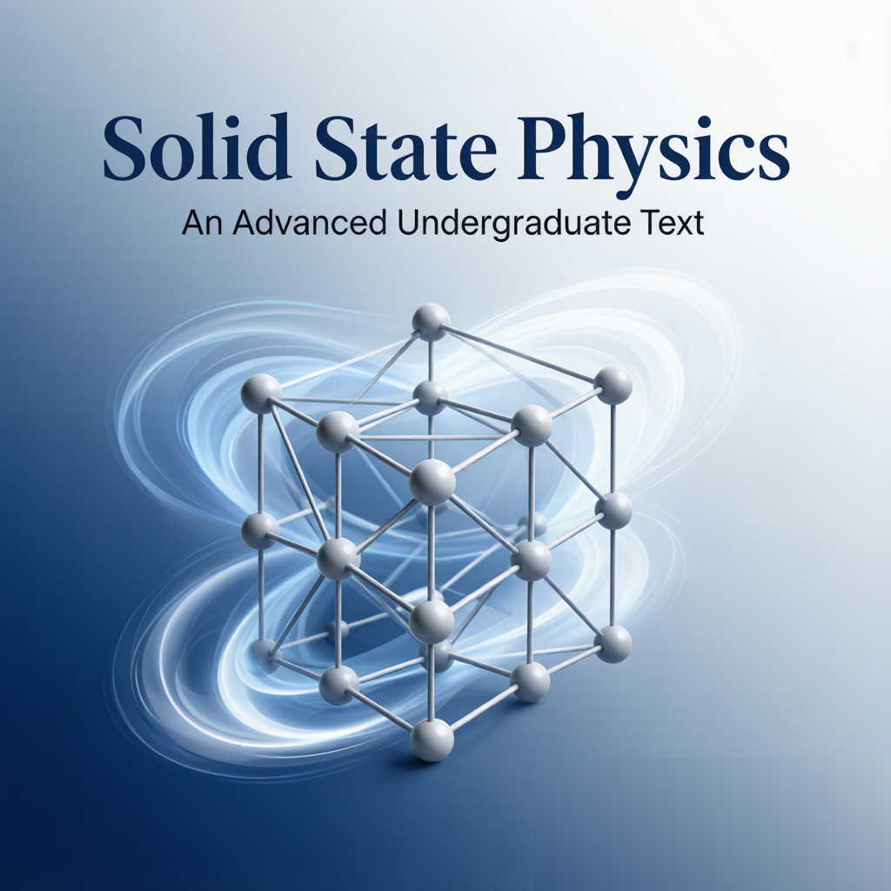

+++ { "kind": "split-image" }

## Welcome to Solid State Physics

An open-source, expert-edited companion to MIT 6.732 *Solid State Physics* (Dresselhaus et al.), covering the transport, optical, magnetic, and superconducting properties of solids.

{button}`Get Started </p1-ch01-energy-dispersion>`

+++

## About Open Science

We are building an open-science knowledge initiative at UC Berkeley BIDMaP. Our vision is a multilingual open knowledge infrastructure for STEM learning in the AI and LLM era. We aim to make scientific knowledge high-quality, authoritative, expert-edited, and freely accessible. This resource will be continuously updated for students, educators, and researchers worldwide. It is designed to benefit anyone, regardless of geography or educational resources. Using band structures as an example, a learner will not only see individual topics but can also navigate across linked concepts. These include optical properties, magnetism, and superconductivity. Built on open-source tools from the Jupyter community, the platform offers textbook-style organization with interactive code, visualizations, downloadable notebooks, and LLM-based content support. It checks content accuracy, organizes frontier updates, and guides interpretation.

:::{important} Our goals

A de-centralized open-source community

- No geo-political issue
- No fee, no barrier, no capital
- Standard open-source community
- Multi-language
- Everyone in the world can use it
- Scientific Community

Just contribute  - for SCIENCE
:::
